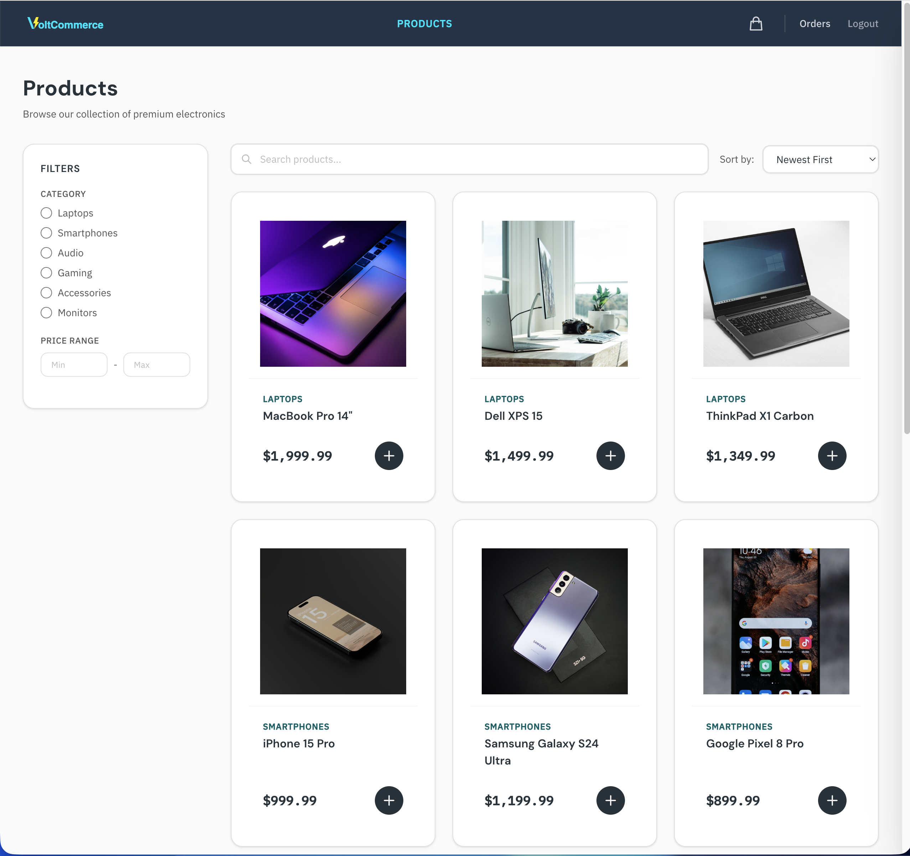
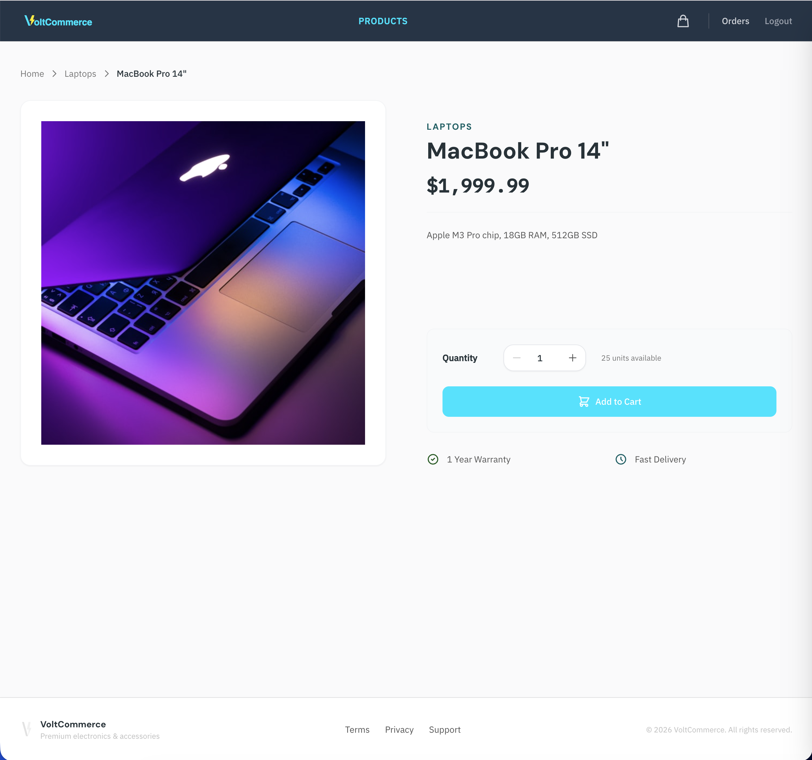
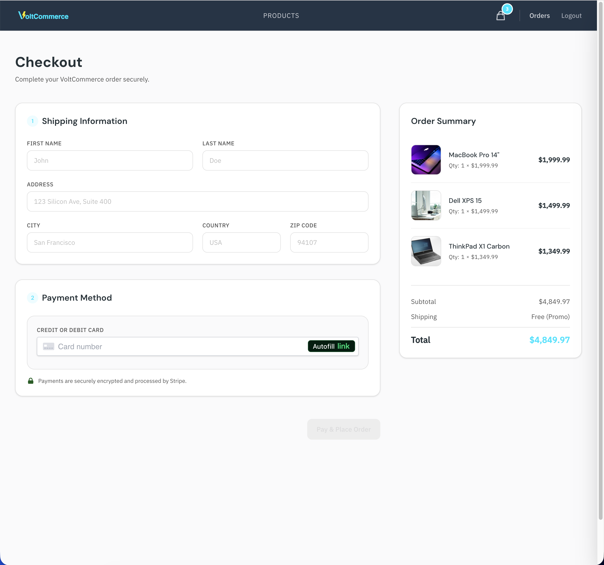
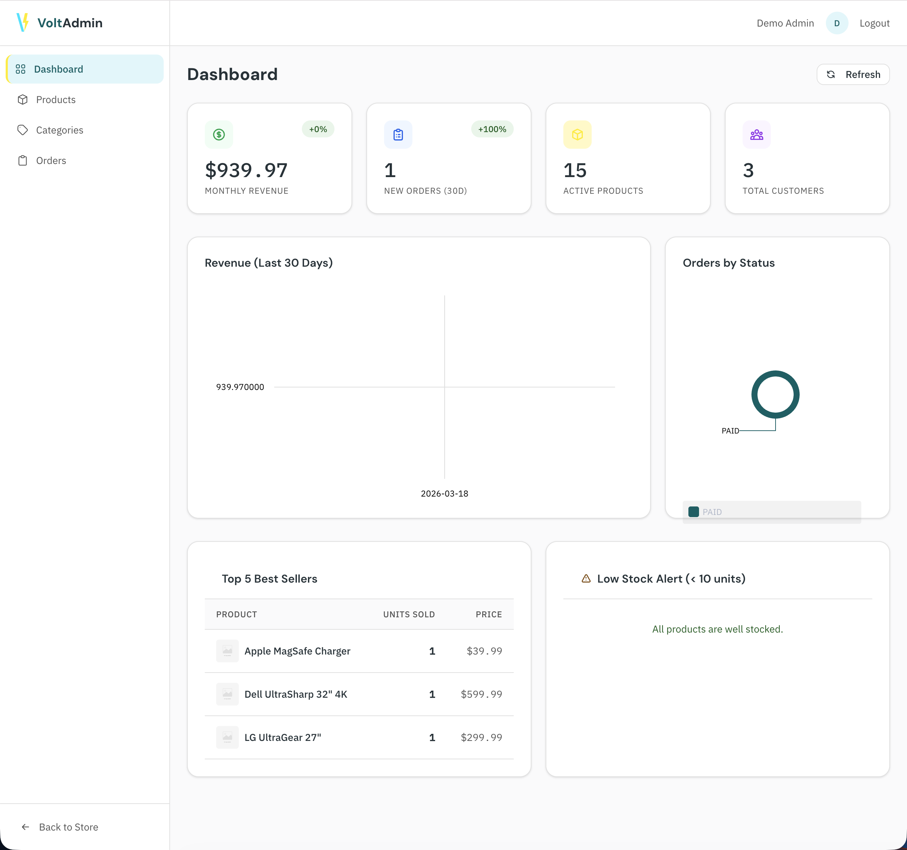
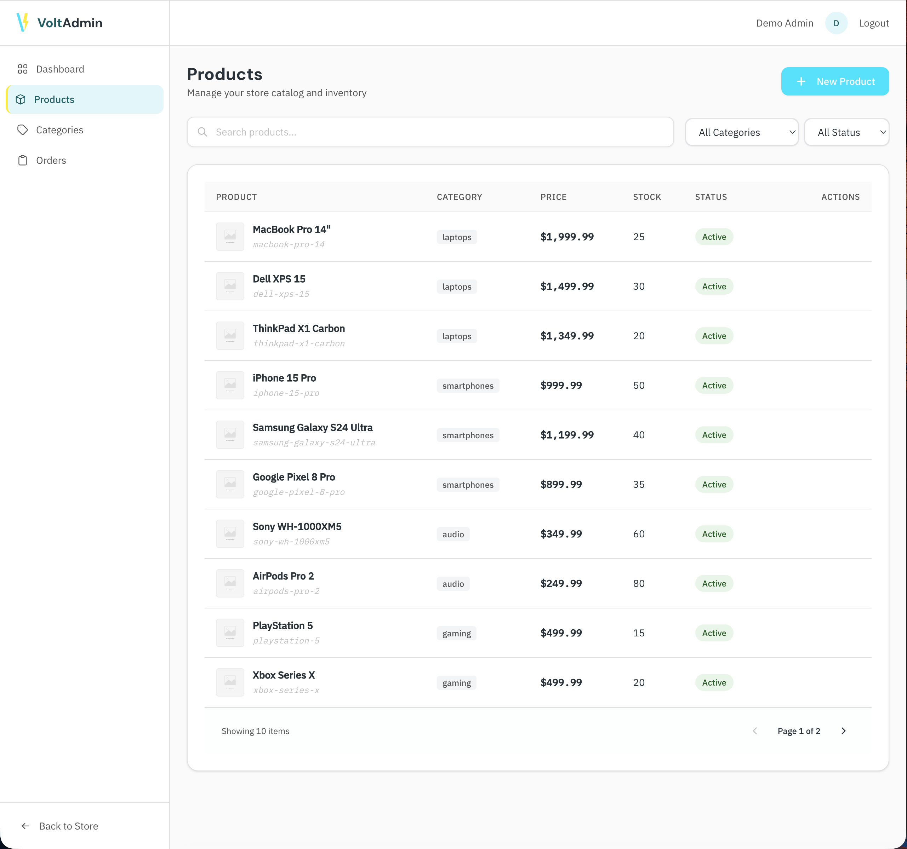
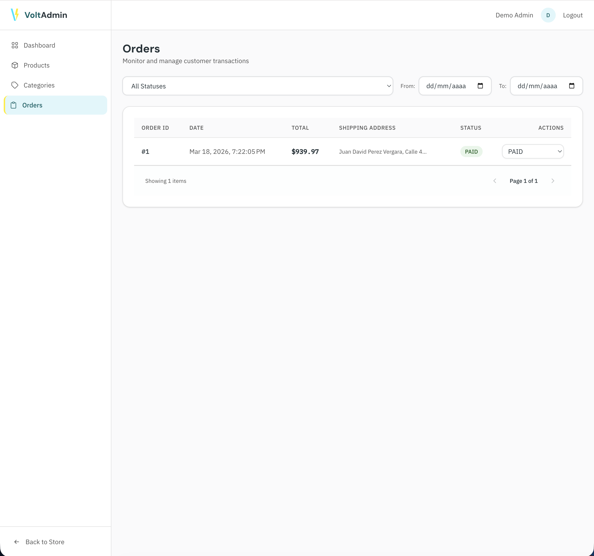

# VoltCommerce

> Full-stack e-commerce platform for electronics — REST API with Spring Boot, Angular storefront, Stripe payments, admin dashboard with analytics, Dockerized with Flyway migrations.

[](https://github.com/juandavidperez/VoltCommerce/actions/workflows/ci.yml)


---

## Live Demo

**Storefront:** [voltcommerce.netlify.app](https://voltcommerce.netlify.app)
**API Docs (Swagger):** [voltcommerce-api.onrender.com/swagger-ui.html](https://voltcommerce-api.onrender.com/swagger-ui.html)

> Note: The backend runs on Render's free tier and may take ~30 seconds to wake up on the first request.

**Demo credentials:**

| Role | Email | Password |
|------|-------|----------|
| Customer | `customer@demo.com` | `demo1234` |
| Admin | `admin@demo.com` | `admin1234` |

**Test card for Stripe:** `4242 4242 4242 4242` · Any future date · Any CVC

---

## Screenshots

| Storefront | Product Detail | Checkout |
|------------|---------------|----------|
|  |  |  |

| Admin Dashboard | Product Management | Order Management |
|-----------------|--------------------|-----------------|
|  |  |  |

---

## Features

### Storefront (Customer)
- Product catalog with server-side filtering by category, price range, and search
- Paginated product grid with skeleton loaders
- Product detail page with stock validation
- Persistent shopping cart with real-time item count badge
- Full checkout flow with Stripe Elements (credit card payments)
- Order history with status tracking timeline (PENDING → PAID → SHIPPED → DELIVERED)

### Admin Dashboard
- KPI cards: monthly revenue, total orders, active products, registered customers
- Sales chart (last 30 days) and order distribution donut chart — powered by ngx-charts
- Product management: create, edit, activate/deactivate, delete with image URLs
- Category management with full CRUD
- Order management: filter by status/date range, update order status
- Low stock alerts table

### Technical Highlights
- JWT authentication with access + refresh token rotation
- Role-based access control (CUSTOMER / ADMIN) enforced at API and route level
- Database schema managed entirely with Flyway versioned migrations (zero Hibernate DDL)
- Stripe Webhook integration for reliable order status updates
- Swagger/OpenAPI documentation for all 20+ endpoints
- Dockerized development environment with hot reload on both frontend and backend
- CI/CD pipeline with GitHub Actions: test on every PR, deploy on merge to main

---

## Tech Stack

| Layer | Technology |
|-------|-----------|
| Frontend | Angular 21 · TypeScript · Tailwind CSS 3 · ngx-charts · Stripe.js |
| Backend | Java 17 · Spring Boot 3.2 · Spring Security · Spring Data JPA |
| Database | PostgreSQL 15 · Flyway migrations · Hibernate ORM |
| Payments | Stripe (PaymentIntents + Webhooks) |
| Storage | Supabase Storage (product images) |
| Deploy | Render (backend) · Netlify (frontend) |
| DevOps | Docker · Docker Compose · GitHub Actions CI/CD |
| Testing | JUnit 5 · Mockito (backend) · Vitest (frontend) |
| Docs | Swagger UI / springdoc-openapi |

---

## Architecture

```
┌─────────────────────────────────────────────────────────┐
│                        Browser                          │
│               Angular SPA (Netlify)                     │
│    Shop routes · Admin routes · Auth · Lazy loading     │
└────────────────────────┬────────────────────────────────┘
                         │ HTTPS / REST
┌────────────────────────▼────────────────────────────────┐
│                  Spring Boot 3 API                      │
│                    (Render)                              │
│  AuthController · ProductController · CartController    │
│  OrderController · AdminController · WebhookController  │
│          Spring Security (JWT) · Swagger UI              │
└──────┬─────────────────┬──────────────────┬─────────────┘
       │                 │                  │
┌──────▼──────┐  ┌───────▼──────┐  ┌───────▼──────┐
│ PostgreSQL  │  │   Supabase   │  │    Stripe    │
│ (Supabase)  │  │   Storage    │  │  Payments +  │
│   Flyway    │  │   (Images)   │  │   Webhooks   │
└─────────────┘  └──────────────┘  └──────────────┘
```

---

## Database Schema

```
users ──────────────────────────────────────────────────┐
  id (UUID), email, password, name, role, createdAt     │
                                                        │
categories          products                            │
  id, name, slug  ←── id, name, slug, description,     │
  description,        price, stock, imageUrl,           │
  imageUrl            categoryId, active                │
                                                        │
carts ──────────── cart_items                           │
  id, userId  ←──── id, cartId, productId, quantity    │
                                                        │
orders ─────────── order_items                          │
  id, userId,  ←──── id, orderId, productId,           │
  status, total,      quantity, unitPrice ◄── price     │
  shippingAddress,                        snapshot at   │
  stripePaymentId                         time of sale  │
```

---

## Getting Started

### Prerequisites

- [Docker](https://www.docker.com/) and Docker Compose
- [Git](https://git-scm.com/)
- A [Stripe](https://stripe.com) account (free test mode)
- A [Supabase](https://supabase.com) project with a public `product-images` bucket

### 1. Clone and configure

```bash
git clone https://github.com/juandavidperez/VoltCommerce.git
cd VoltCommerce
cp .env.example .env
```

Edit `.env` with your credentials:

```env
POSTGRES_DB=voltcommerce
POSTGRES_USER=postgres
POSTGRES_PASSWORD=your_password
JWT_SECRET=your_jwt_secret_min_32_chars
SUPABASE_URL=https://your-project.supabase.co
SUPABASE_KEY=your_supabase_anon_key
STRIPE_SECRET_KEY=sk_test_...
STRIPE_WEBHOOK_SECRET=whsec_...
```

### 2. Start the stack

```bash
docker compose up
```

This starts three services:
- **PostgreSQL** on port `5432` — Flyway runs migrations automatically
- **Spring Boot API** on port `8080` — with hot reload via DevTools
- **Angular** on port `4200` — with hot reload

### 3. Set up Stripe webhooks (local dev)

```bash
stripe listen --forward-to localhost:8080/api/webhooks/stripe
```

Copy the signing secret and update `STRIPE_WEBHOOK_SECRET` in `.env`.

### 4. Open the app

| Service | URL |
|---------|-----|
| Storefront | http://localhost:4200 |
| Admin Panel | http://localhost:4200/admin |
| Swagger UI | http://localhost:8080/swagger-ui.html |
| API Health | http://localhost:8080/actuator/health |

### 5. Test a payment

1. Register or login with `customer@demo.com` / `demo1234`
2. Add products to cart
3. Go to Checkout
4. Use test card: `4242 4242 4242 4242`, any future expiry, any CVC
5. The webhook will automatically update the order status to PAID

---

## Running Tests

```bash
# Backend (JUnit 5 + Mockito)
docker compose exec backend ./mvnw test

# Frontend (Vitest)
docker compose exec frontend npx ng test --watch=false
```

---

## Key Technical Decisions

**Flyway over Hibernate DDL** — All schema changes go through versioned Flyway migrations (`V1__`, `V2__`, ...) with `ddl-auto=none`. This gives full control over the database schema, a clear audit trail, and safe production deployments where Flyway creates tables automatically on first boot.

**unitPrice snapshot in order_items** — Each `OrderItem` captures the product price at purchase time rather than referencing the current price. This ensures order history stays accurate even when prices change later — a common real-world requirement.

**Stripe Webhooks for order status** — Instead of marking orders as PAID on frontend confirmation, the backend relies on `payment_intent.succeeded` webhook events. This handles edge cases like network failures and ensures payment state is always consistent with Stripe's records.

**Spring Data Specifications for filtering** — Product catalog filtering uses the Specification pattern to dynamically combine category, price range, search, and sort filters without writing a separate JPQL query for each combination.

**Dual-layer route protection** — Admin routes are guarded by `adminGuard` on the frontend (UX) and `hasRole('ADMIN')` on the backend (security). Authentication is never delegated to the frontend alone.

---

## API Reference

Full interactive documentation at [`/swagger-ui.html`](https://voltcommerce-api.onrender.com/swagger-ui.html).

| Group | Base Path | Auth |
|-------|-----------|------|
| Auth | `/api/auth` | Public |
| Products | `/api/products` | Public (GET) |
| Categories | `/api/categories` | Public (GET) |
| Cart | `/api/cart` | Customer |
| Orders | `/api/orders` | Customer |
| Admin Products | `/api/admin/products` | Admin |
| Admin Categories | `/api/admin/categories` | Admin |
| Admin Orders | `/api/admin/orders` | Admin |
| Admin Dashboard | `/api/admin/dashboard` | Admin |
| Webhooks | `/api/webhooks/stripe` | Stripe signature |

---

## Deployment

### Backend → Render

The backend deploys as a Docker Web Service using `backend/Dockerfile.prod` (multi-stage: Maven build → JRE slim runtime with non-root user).

Required environment variables: `SPRING_DATASOURCE_URL`, `SPRING_DATASOURCE_USERNAME`, `SPRING_DATASOURCE_PASSWORD`, `JWT_SECRET`, `STRIPE_SECRET_KEY`, `STRIPE_WEBHOOK_SECRET`, `SUPABASE_URL`, `SUPABASE_KEY`, `CORS_ALLOWED_ORIGINS`, `SERVER_PORT=10000`, `SPRING_PROFILES_ACTIVE=prod`.

### Frontend → Netlify

Build configuration is in `frontend/netlify.toml`. Netlify auto-deploys on push to `main`. SPA routing is handled via the `[[redirects]]` rule.

### CI/CD — GitHub Actions

The pipeline runs on every push and PR:
1. **Backend**: JDK 17 + PostgreSQL service → `mvn clean verify`
2. **Frontend**: Node 22 → `ng test` → `ng build --production`
3. **Deploy** (only on `main`): Triggers Render Deploy Hook + Netlify CLI deploy

**Required GitHub Secrets:**

| Secret | Source |
|--------|--------|
| `RENDER_DEPLOY_HOOK_URL` | Render → Settings → Deploy Hook |
| `NETLIFY_SITE_ID` | Netlify → Site configuration → Site ID |
| `NETLIFY_AUTH_TOKEN` | Netlify → User settings → Personal access tokens |

---

## Author

**Juan David Perez Vergara** — Fullstack Developer

[](https://www.linkedin.com/in/juandpv/)
[](https://github.com/juandavidperez)

Medellín, Colombia
